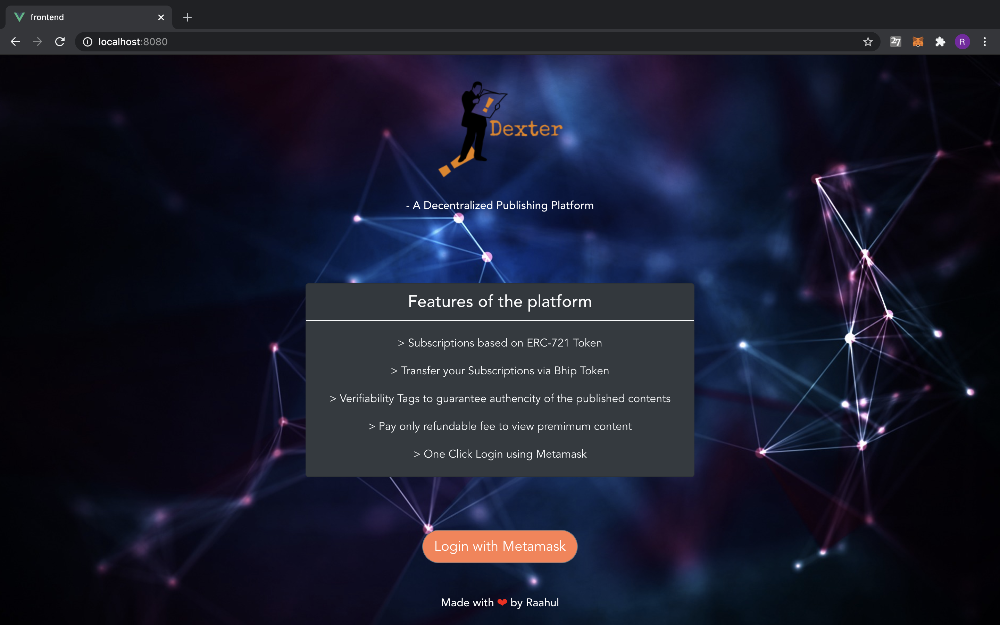
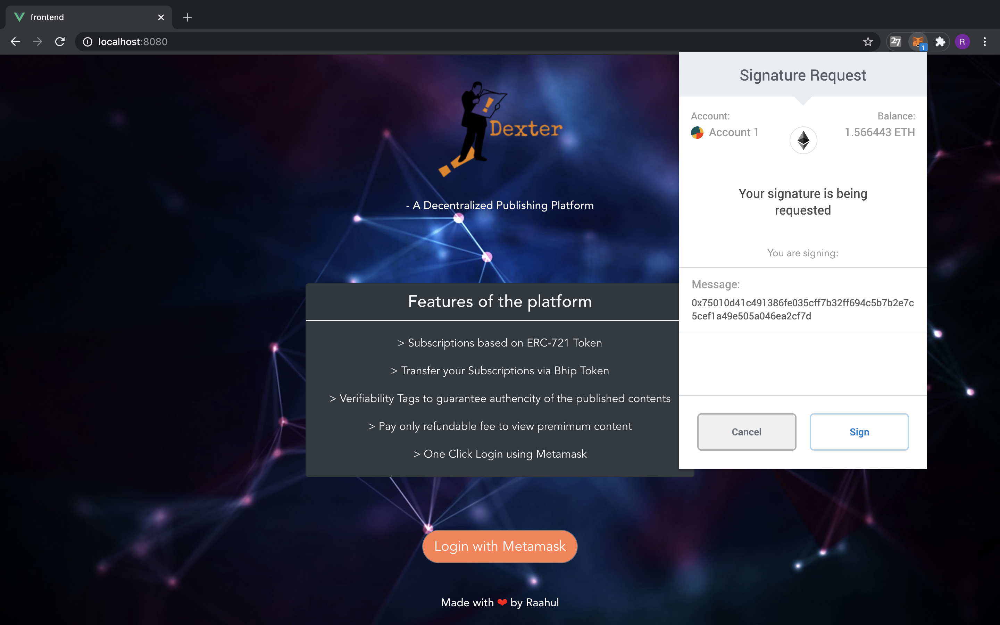
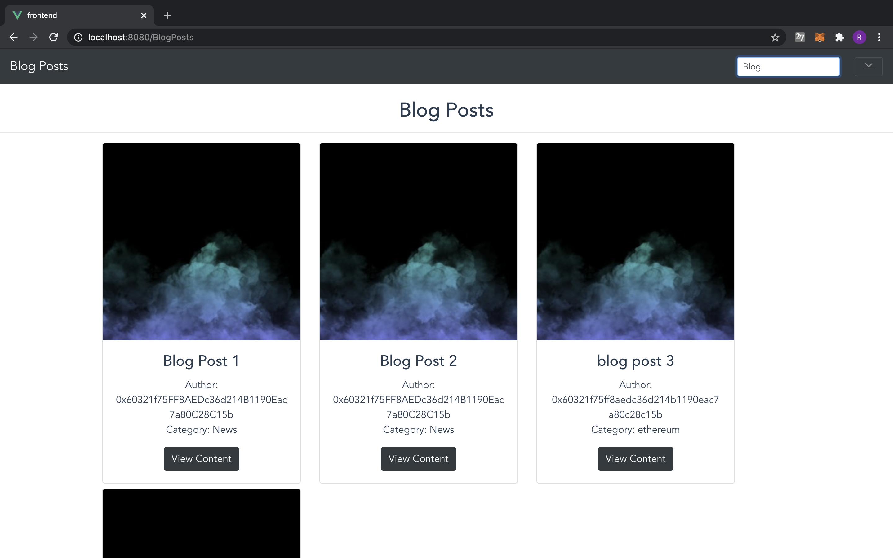
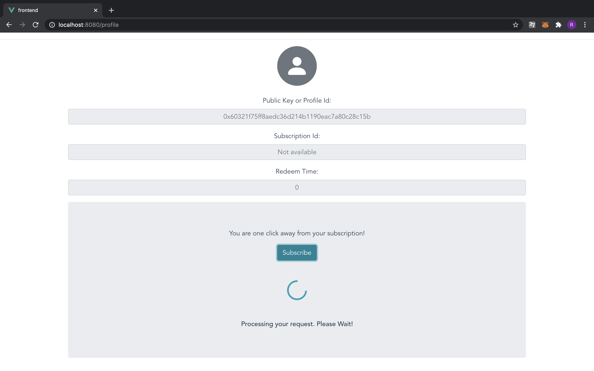
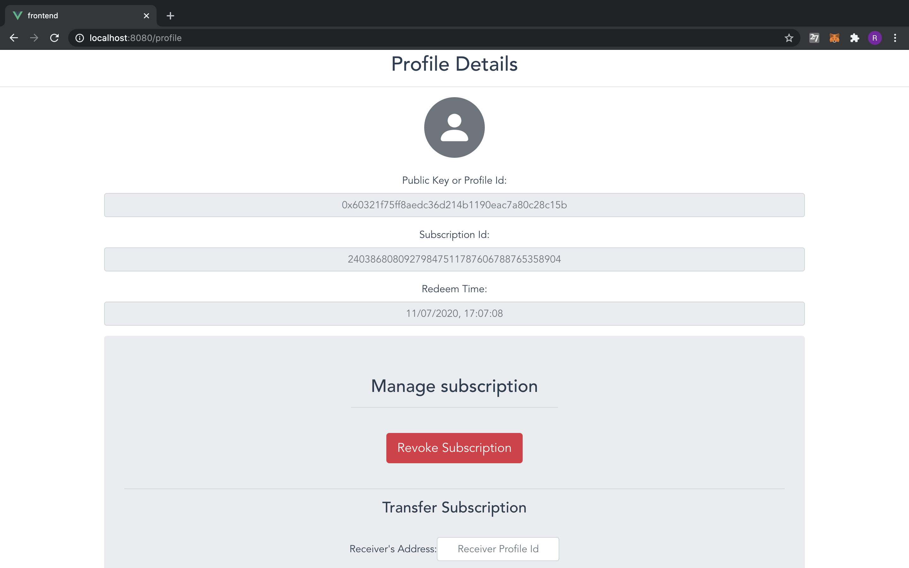
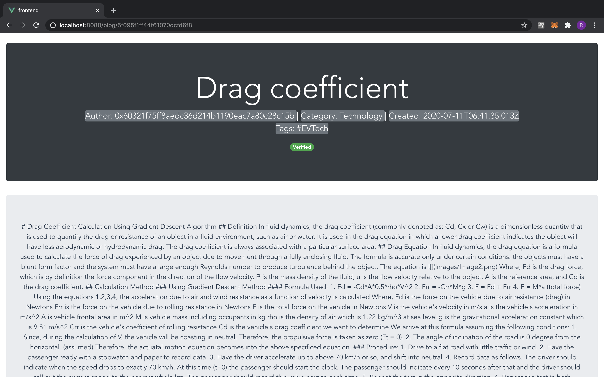

# Ethereum_India_Fellowship_Project

This project was created as a part of the Ethereum India Fellowship 2020 program, organized by Devfolio. The project aimed to design a decentralized and blockchain-based platform for publishing blogs, articles, and many more. Although the basis of the project was mainly centered around creating a decentralized publishing application, several novel innovations like subscription tokens, verifiability tags were brought into the paradigm. The following sections serve to explain the project in detail.

## DEXTER - A DECENTRALIZED PUBLISHING PLATFORM

### Problem Solved: 
The current scenario of traditional web-based publishing sites does not guarantee the authenticity of the articles and blogs. 
A need for a mechanism to prove the originality of the information for the readers is of utmost importance. 
To introduce this indispensable feature, this project has pioneered the idea of incorporating the Blockchain Technology to present the articles with validity tags, that can prove the authenticity of the content. 
Besides this, the platform does not burden the users with any subscription fee. Instead, the user needs to pay only a refundable fee (in DAI stable coin) to access the premium articles. 
One-click signup and login through Metamask have been incorporated to reduce the unnecessary steps during the login process. 
Lastly, the platform is decentralized, and blockchain verified, thus ensures the hashing level security and immutability through its design features.

### Steps to configure this application:
Firstly, clone the project into your desired directory. Next, open the terminal from that folder and run the following commands.
- cd fullstack
- npm run serve. 
  This command will run the app in development mode. Open http://localhost:8080/ using the browser of your choice. 
- The login function for the application has been configured using Metamask. Therefore, the browser should have this installed feature to perform the login action. To add Metamask to your browser, follow the below link: https://medium.com/@followcoin/how-to-install-metamask-88cbdabc1d28
- Once you have Metamask installed, Click the login and explore the application. 

### Technologies Used & Keywords

1. Ethereum Solidity
2. NodeJS
3. VueJS
4. MongoDB
5. MakerDAO
6. Compound Protocol
7. ExpressJS
8. Web3JS
9. ERC-721 Standars
10. Bootstrap-vue

### Screen Shots

1. Home Screen

2. Login & Metmask integration

3. Blog Posts Screen

4. Profile Screen

5. Add Blog Screen

6. Article Screen

